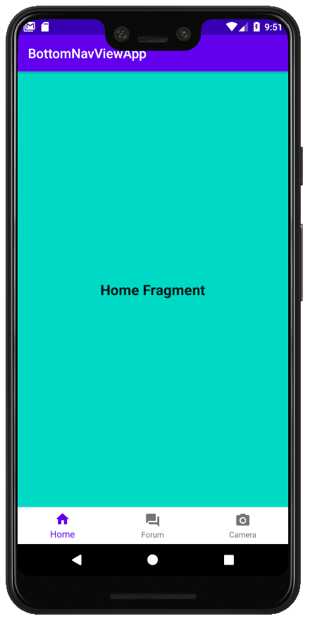
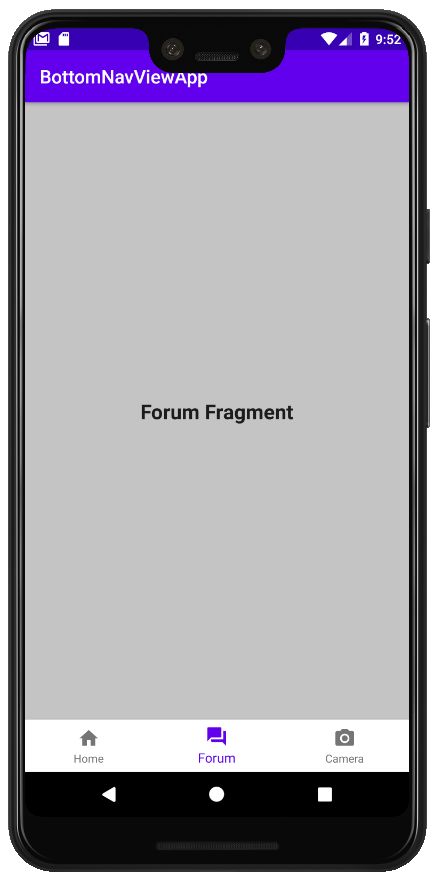
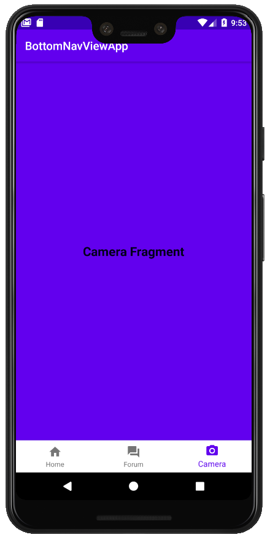

# BottomNavView
Bottom Navigation View with Fragments and Animations

## Add dependency in build.gradle (module: app):

```
    // Bottom Navegation View
    implementation 'com.google.android.material:material:1.1.0'
```

## Compile sdk version in Gradle (Module:app):

```
    compileSdkVersion 29
```

## Creating menu, container, fragments, animation:


Defining a menu resource directory:

```
  <menu xmlns:android="http://schemas.android.com/apk/res/android">
      <item android:id="@+id/home"
          android:icon="@drawable/ic_home"
          android:title="Home"/>

      <item android:id="@+id/forum"
          android:icon="@drawable/ic_forum"
          android:title="Forum"/>

      <item android:id="@+id/camera"
          android:icon="@drawable/ic_camera"
          android:title="Camera"/>
  </menu>
```

Defining an anim resource directory:

```
    in: <alpha
        android:fromAlpha="0"
        android:toAlpha="1"
        android:duration="500"
        android:interpolator="@android:anim/accelerate_interpolator"/>
        
    out: <alpha
         android:fromAlpha="1"
         android:toAlpha="0"
         android:duration="500"
         android:interpolator="@android:anim/accelerate_interpolator"/>
```

Defining in activity_main.xml:

```
    <FrameLayout
        android:id="@+id/layout_container"
        android:layout_width="match_parent"
        android:layout_height="0dp"
        app:layout_constraintBottom_toTopOf="@+id/bottom_nav_view"
        app:layout_constraintEnd_toEndOf="parent"
        app:layout_constraintStart_toStartOf="parent"
        app:layout_constraintTop_toTopOf="parent" />

    <com.google.android.material.bottomnavigation.BottomNavigationView
        android:id="@+id/bottom_nav_view"
        android:layout_width="match_parent"
        android:layout_height="wrap_content"
        app:menu="@menu/menu_bottom_nav_view"
        android:background="@android:color/white"
        app:layout_constraintBottom_toBottomOf="parent"
        app:layout_constraintEnd_toEndOf="parent"
        app:layout_constraintStart_toStartOf="parent" />
```

In MainActivity.java implements BottomNavigationView.OnNavigationItemSelectedListener:

```
  public class MainActivity extends AppCompatActivity implements BottomNavigationView.OnNavigationItemSelectedListener
```

Finally, I defined 3 fragments (home, forum, and camera). I used them in MainActivity.java into onNavigationItemSelected method.

```
@Override
    public boolean onNavigationItemSelected(@NonNull MenuItem item) {
    
    switch (item.getItemId()){
            case R.id.home:
                getSupportFragmentManager().beginTransaction()
                        .setCustomAnimations(R.anim.slide_in, R.anim.slide_out)
                        .replace(R.id.layout_container, home)
                        .commit();
                return true;
            .....
```

<p align="center">
  

</p>
